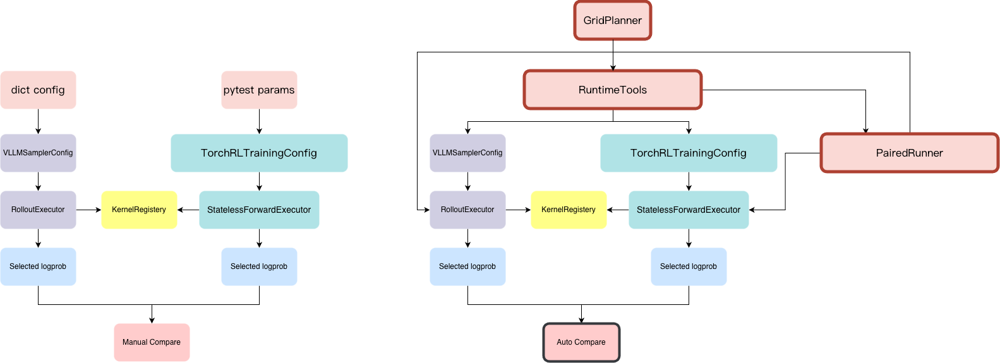

# WS2 Cross-Config Logprob Drift Contract

Status: RFC

Tracking issues:

- [#111: WS2 cross-config alignment](https://github.com/RL-Align/RL-Kernel/issues/111)
- [#108: WS1 numerical contract](https://github.com/RL-Align/RL-Kernel/issues/108)

## Motivation

WS2 covers rollout and training paths that use different parallelism strategies, such as
rollout tensor parallelism and training FSDP. The alignment problem is not a single-op
accuracy check. It is end-to-end floating-point drift across tokenizer, masks, serving,
rollout, and training recomputation before any optimizer update.

For PPO, GRPO, and related RL post-training algorithms, the most direct pre-update signal
is selected-token log probability drift. If rollout-side `old_logprobs` and train-side
recomputed log probabilities disagree for the same checkpoint, same token ids, same masks,
and same model version, classify the failure as infrastructure, precision, mask,
tokenizer, or serving-path drift. Do not classify that failure as an algorithm or reward
problem until pre-update logprob alignment is clean.

Aggregate KL-style diagnostics are useful but not sufficient as the primary WS2 contract.
In training-inference mismatch cases, KL estimates can stay flat or fail to expose the
early failure phase, because the first-order issue is token-level rollout-vs-training
probability disagreement before the optimizer update, not necessarily a large aggregate
policy-space shift.

## Framework Upgrade Overview

The upgrade moves cross-config validation from two separately configured execution paths
that require a manual comparison into a shared runtime flow. `RuntimeTools` coordinates
the rollout and training configurations, while `PairedRunner` collects their selected
logprobs and performs the comparison automatically. This keeps both sides aligned on the
same inputs and makes drift visible as part of the run rather than as a follow-up manual
check.



The left side shows the pre-upgrade flow, where `VLLMSamplerConfig` and
`TorchRLTrainingConfig` feed independent executors and the results are manually compared.
The right side shows the upgraded flow, where `RuntimeTools` and `PairedRunner` connect the
two paths and produce an automatic comparison while preserving the shared
`KernelRegistry` contract.

## Scope

This RFC defines what WS2 cross-config alignment measures, how failures are classified,
and the modular implementation roadmap for making that contract executable. It does not
itself add a test harness, distributed tests, runtime gates, layer-wise probes, or
distributed fixes.

Out of scope for this document:

- Implementing multi-GPU test infrastructure.
- Adding runtime pass/fail gates.
- Adding automatic layer-wise drift probes.
- Fixing TP, FSDP, SP, cache, mask, tokenizer, or serving-path bugs.
- Defining a second numerical tolerance table.
- Reimplementing work owned by the adjacent TP, SP, collective, training-integration, or
  layer-probe issues referenced by the roadmap below.

## Measurement Contract

The primary metric is selected-token logprob drift:

```text
dlogp = train_recomputed_logp - rollout_old_logp
```

Compute `dlogp` only on active response/action tokens. Prompt tokens, padding tokens, and
masked-out response positions are excluded from every aggregate metric.

The comparison must use teacher-forcing scoring on the training side. The scored sequence
is the already-sampled rollout sequence; the training path must not resample or regenerate
tokens for this contract.

The rollout and training values are comparable only when they share the same logical
inputs:

- Same checkpoint and same model version.
- Same input token ids.
- Same selected response/action token ids.
- Same attention mask and action mask.
- Same tokenizer version and tokenization policy.
- Same padding layout semantics, including left-padding or right-padding behavior.
- Same pre-update state, before any optimizer step, weight sync, or policy mutation that
  belongs to the next training step.

If the implementation has explicit position ids, cache-position metadata, sequence ids, or
packed-sequence metadata, those inputs are part of the comparison contract as well.

## Primary Failure Signal

The pass/fail decision starts from `dlogp` over active tokens. Reward, gradnorm,
weightnorm, and update norm are downstream symptoms. They are useful for debugging and
triage, but they are not the primary contract for cross-config alignment.

The zero-update expectation is:

```text
train_recomputed_logp ~= rollout_old_logp
ratio0 ~= 1
approx_kl0 ~= 0
```

The acceptable meaning of `~=` is defined by the WS1 per-dtype numerical threshold table
from [#108](https://github.com/RL-Align/RL-Kernel/issues/108). This RFC defines the
measurement surface and classification rules only.

## Diagnostics

All diagnostics are computed on active response/action tokens only.

| Metric | Definition | Purpose |
| --- | --- | --- |
| `ratio0` | `exp(dlogp)` | Zero-update policy ratio implied by train-vs-rollout logprob drift. |
| `clipfrac0` | Mean indicator that `ratio0` falls outside the configured PPO/GRPO clip range. | Detects whether drift alone would trigger clipping before any update. |
| `approx_kl0` | Masked mean of `exp(dlogp) - 1 - dlogp`. | Zero-update approximate KL implied by logprob drift. |
| `mean_abs_dlogp` | Mean of `abs(dlogp)`. | Average selected-token drift. |
| `p95_abs_dlogp` | 95th percentile of `abs(dlogp)`. | Tail drift below outliers. |
| `p99_abs_dlogp` | 99th percentile of `abs(dlogp)`. | High-tail drift. |
| `max_abs_dlogp` | Maximum of `abs(dlogp)`. | Worst selected-token mismatch. |

When the run is distributed, report optional per-rank versions of the same metrics. The
per-rank view should preserve enough metadata to identify the rollout rank, training rank,
parallelism mode, dtype, padding side, cache mode, and local active-token count for that
rank.

## Tolerance Source

This RFC does not define a separate numerical tolerance table. The single source of truth
for acceptable numerical drift is the per-dtype threshold table owned by
[#108](https://github.com/RL-Align/RL-Kernel/issues/108).

For WS2, acceptable numerical drift means that `max_abs_dlogp` over active
response/action tokens satisfies the WS1 per-dtype threshold from #108. If the #108 table
changes, WS2 inherits that policy without editing this document or maintaining a second
table.

## Tolerance Interpretation and Effect-Based Validation

Numerical tolerances in this RFC are infrastructure contract thresholds, not a universal
statement of algorithmic harmlessness. There is no model-independent scale that proves a
given train-vs-rollout logprob difference is harmless for every algorithm, reward model,
prompt distribution, sequence length, or optimization schedule. Any hand-written threshold
encodes a prior about acceptable numerical error. WS2 therefore does not introduce an
additional algorithmic noise budget, nor does it define a new estimator for tolerable
logprob noise.

The #108 threshold defines whether rollout and training paths are numerically aligned
enough to continue debugging the failure as an algorithmic or reward problem. It does not
prove that all smaller drift is behaviorally irrelevant, and it does not imply that all
larger drift is the only cause of downstream failure.

When downstream model-effect validation is available, such as reward trajectory, train KL,
eval win rate, collapse rate, policy regression tests, or task-specific success metrics,
use it as a severity and root-cause prioritization signal. It must not replace the
pre-update selected-token logprob contract. A run can be numerically out of contract even
if a short downstream run appears healthy, and a run can be numerically in contract while
still failing because of algorithmic tuning, reward hacking, insufficient KL control, or
data issues.

The intended interpretation is:

```text
#108 per-dtype threshold:
    numerical infrastructure contract

selected-token dlogp:
    primary WS2 train-vs-rollout drift surface

downstream model effect:
    practical severity and algorithmic relevance signal

KL / ratio / percentile diagnostics:
    debugging and triage signals, not replacement pass/fail criteria
```

## Drift Source Taxonomy

Before treating train-vs-rollout drift as generic algorithmic noise, WS2 should classify
likely sources of mismatch. At minimum, the following source classes should be considered
separately.

### Arithmetic Schedule Drift

Arithmetic schedule drift comes from different floating-point operation order between
rollout and training. This includes different kernels, fused vs unfused implementations,
compiler-generated graph rewrites, attention implementation differences, matmul epilogue
differences, accumulation dtype differences, and changes introduced by advanced compilers
or graph optimizers.

This class answers the question:

```text
Do rollout and training compute mathematically equivalent expressions using different
floating-point schedules?
```

Examples include:

- Fused attention vs unfused attention.
- Different FlashAttention or SDPA backends.
- Fused RMSNorm or LayerNorm vs decomposed normalization.
- Compiler-reordered graph segments.
- Different matmul epilogues or activation fusion.
- Different accumulation precision in otherwise equivalent kernels.

### Reduction and Collective Drift

Reduction drift comes from operations whose floating-point result depends on reduction
order, parallel topology, or concurrent execution. This includes local reductions,
cross-rank reductions, all-reduce, reduce-scatter, gather/scatter patterns, sharded logits
or loss computation, tensor-parallel collectives, FSDP reductions, and nondeterministic
reduction scheduling.

This class answers the question:

```text
Does the mismatch appear because rollout and training aggregate partial results in
different orders or across different rank topologies?
```

Examples include:

- TP logits produced through a different collective path from the training path.
- FSDP reduce-scatter or all-gather changing accumulation order.
- Per-rank partial reductions with different shard boundaries.
- Loss or logprob reductions performed before vs after cross-rank communication.
- Nondeterministic collective algorithms or concurrent reductions.

### Quantization and Dequantization Drift

Quantization drift comes from representing weights, activations, KV cache, logits, or
intermediate tensors with different quantization policies between rollout and training.
Quantization is not merely a floating-point ordering issue; it introduces representation
noise through scales, zero points, clipping, grouping, calibration, and dequantization
paths.

This class answers the question:

```text
Does the mismatch appear because rollout and training use different numerical
representations or quantization policies?
```

Examples include:

- Rollout uses weight-only quantization while training recomputation uses bf16/fp16
  weights.
- Different quantization group sizes.
- Different activation quantization or KV-cache quantization policy.
- Different scale computation or calibration data.
- Different dequantization placement relative to fused kernels.
- Serving-path quantization that is absent from the training path.

### Logical Input and Metadata Drift

Logical input mismatch must be ruled out before interpreting any result as numerical
drift. This class includes tokenizer version, tokenization policy, attention mask, action
mask, padding side, explicit position ids, cache positions, sequence ids, packed-sequence
metadata, and serving-path request formatting.

This class answers the question:

```text
Are rollout and training actually scoring the same logical sequence under the same masking
and positional semantics?
```

If this class is not clean, the comparison is invalid rather than merely noisy.

## Decision Rule

Use this order when classifying a cross-config failure:

1. If pre-update selected-token logprobs do not match under the same checkpoint, same token
   ids, same masks, and same model version, treat the failure as infrastructure,
   precision, mask, tokenizer, or serving-path drift.
2. If `max_abs_dlogp` violates the #108 threshold but downstream metrics look healthy in a
   short run, keep the issue classified as infrastructure drift. Short-horizon model
   health does not prove the drift is safe.
3. If KL or ratio diagnostics move before gradnorm or update norm moves, treat the failure
   as likely infrastructure or logprob plumbing.
4. If gradnorm or update norm moves first and KL moves later, treat the failure as more
   likely algorithmic tuning, such as learning rate, KL beta, reward scale, or advantage
   outliers.
5. If only some ranks drift, treat the failure as distributed infrastructure until rank
   placement, shard boundaries, collective algorithms, local active-token counts, masks,
   and cache-position issues are ruled out.
6. If reward rises and then collapses while pre-update logprob alignment is clean, treat
   the failure as more likely algorithmic, reward hacking, data-related, or insufficient
   KL constraint.

This classification does not prove root cause by itself. It defines the first branch in
the debugging tree so WS2 bugs do not get misfiled as reward or algorithm regressions
before the zero-update logprob contract is satisfied.

## Layered Ablation Strategy

WS2 should not treat train-vs-rollout mismatch as a single undifferentiated error source.
Later tests should use a layered ablation strategy that changes one source class at a time
whenever the implementation allows it.

The minimum useful ablation structure is:

```text
A0. Fully aligned reference
    Same checkpoint, same dtype policy, same kernels where possible, same reduction
    topology where possible, same quantization policy, same tokenizer, same masks, same
    padding, same cache/position metadata.

A1. Arithmetic-schedule-only mismatch
    Keep logical inputs, reduction topology, and quantization policy aligned. Allow only
    kernel, fusion, compiler, or graph execution differences.

A2. Reduction-topology-only mismatch
    Keep logical inputs, kernel policy, and quantization policy aligned. Allow only
    reduction order, collective topology, sharding, or rank placement differences.

A3. Quantization-only mismatch
    Keep logical inputs, kernel policy, and reduction topology aligned. Allow only
    quantization, dequantization, scale, group size, or representation differences.

A4. Pairwise mismatches
    Enable two mismatch classes at a time:
        arithmetic + reduction
        arithmetic + quantization
        reduction + quantization

A5. Full production mismatch
    Use the real rollout and training configurations, including all production
    differences.
```

Each ablation should collect the same primary and diagnostic metrics:

```text
primary:
    dlogp over active response/action tokens
    max_abs_dlogp

diagnostics:
    mean_abs_dlogp
    p95_abs_dlogp
    p99_abs_dlogp
    ratio0
    clipfrac0
    approx_kl0
    per-rank versions when distributed

metadata:
    dtype
    kernel/backend choices
    fusion/compiler mode
    reduction/collective topology
    quantization policy
    padding side
    cache mode
    position/cache-position metadata
    active-token count
```

When downstream model-effect validation is available, the same ablations should also
record practical training outcomes, for example reward trajectory, training KL, entropy,
clip fraction, update norm, collapse rate, and task-specific evaluation metrics. These
downstream metrics are not the WS2 pass/fail contract, but they help rank which numerical
mismatch class matters most for the workload.

## Ablation Interpretation Rules

Use these rules when reading the ablation matrix:

1. If the fully aligned reference fails, the issue is not a cross-config mismatch yet.
   First debug the base scoring path, masks, tokenizer, position metadata, checkpoint
   identity, or implementation correctness.
2. If a single-source ablation fails the `max_abs_dlogp` contract, that source class is
   sufficient to create unacceptable train-vs-rollout drift under the tested workload. For
   example, if only quantization is misaligned and the run fails, quantization is a
   dominant source candidate for that task and configuration.
3. If all single-source ablations pass, but pairwise or full-production mismatches fail,
   the failure is likely an interaction effect. Identify the minimal failing pair before
   attributing the issue to any single subsystem.
4. If one single-source ablation passes the numerical contract but shows materially worse
   downstream model effect, record it as behaviorally sensitive even if it remains
   numerically in contract. This is a signal that the #108 infrastructure tolerance may be
   sufficient for numerical alignment but not necessarily predictive of algorithmic
   robustness for that workload.
5. If pre-update logprob alignment is clean but downstream training still collapses,
   classify the failure as more likely algorithmic, reward-related, data-related, or
   KL-control-related rather than cross-config numerical drift.

## Minimal and Layered Alignment Principle

The governing principle of WS2 is **minimal alignment**:

> Keep rollout and training semantically identical, then align only the smallest numerical
> layer needed to satisfy the selected-token logprob contract.

WS2 does not require every internal tensor, kernel, reduction, or execution schedule to be
identical. If the production rollout and training paths already satisfy the #108
`logprob` tolerance, no numerical alignment change is required. Different engines are
allowed to keep different high-performance implementations.

Minimal alignment does not relax logical correctness. Checkpoint/version, token ids,
masks, tokenizer semantics, and required position metadata must match exactly. A logical
input mismatch invalidates the experiment; it is not acceptable numerical drift.

### Alignment Ladder

Use the following ladder in order and stop at the first level that satisfies the contract:

| Level | Action | Production implication |
| --- | --- | --- |
| L0: semantic identity | Make logical inputs and model version exactly comparable. | Mandatory for every case. |
| L1: observable contract | Keep both production paths unchanged and compare selected-token logprobs. | Stop here if #108 passes. |
| L2: source isolation | Change one declared knob at a time to locate the smallest sufficient drift source. | Diagnostic only; do not change production yet. |
| L3: local alignment | Align or fix one operator, collective, metadata field, or representation policy. | Preferred production fix when L1 fails. |
| L4: layered alignment | Align the smallest interacting pair or contiguous layer boundary that is required. | Use only when no single local change is sufficient. |
| L5: full/bitwise alignment | Force broad identical paths or reference implementations. | Diagnostic fallback, not the default WS2 exit criterion. |

The chosen fix should minimize, in order:

1. semantic scope changed;
2. number of aligned knobs;
3. performance and memory overhead;
4. engine-specific intrusion;
5. maintenance burden.

A fix is incomplete if it proves only that the fully aligned reference passes. It must
also show that unrelated rollout/training differences can remain enabled. Conversely, WS2
must not reject a configuration merely because internal tensors are not bitwise equal when
the selected-token contract passes.

## Controller-Centered Design

The central feature is an ablation controller, not a hard-coded list of distributed
tests. It separates experiment planning from engine-specific knob application.

```mermaid
flowchart LR
    Definition["ExperimentDefinition<br/>identity + baseline + axes + constraints"]
    Planner["GridPlanner<br/>product / one-at-a-time / pairwise"]
    Isolation["IsolationValidator<br/>declared deltas only"]
    Definition --> Planner --> Isolation

    Isolation --> Cases["ExperimentCase[]<br/>stable ids + provenance"]

    subgraph Materializers["Knob materializers"]
        Rollout["vLLM adapter"]
        Training["stateless / FSDP adapter"]
        Kernel["kernel policy adapter"]
        Environment["process/build environment adapter"]
    end

    Cases --> Materializers
    Materializers --> Runner["isolated paired runner"]
    Runner --> Samples["canonical alignment samples"]
    Samples --> Comparator["identity validator + dlogp comparator"]
    Comparator --> Cube["result cube<br/>axes + per-rank reports + cost"]
    Cube --> Analyzer["minimal sufficient alignment analyzer"]
```



### Core Objects

The implementation should expose a small typed model rather than passing more loose
dictionaries through the current executors:

- `SemanticIdentitySpec`: checkpoint/weight version, tokenizer, fixed token sequences,
  masks, and position metadata that must match.
- `ScorerSpec`: rollout or training engine, world size, device/dtype, and immutable engine
  construction settings.
- `KnobDefinition`: one controllable source of variation.
- `ExperimentDefinition`: baseline scorers plus axes, constraints, and measurement policy.
- `ExperimentCase`: one fully materialized grid point with a stable content-derived id.
- `AlignmentSample`: logical tensors, selected logprobs, and actual runtime provenance.
- `AlignmentResult`: global/per-rank drift, pass/fail, actual applied knobs, and optional
  cost metrics.
- `ResultCube`: results indexed by normalized knob values, independent of execution order.

Every `KnobDefinition` must declare:

```text
name:
    stable dotted name, for example rollout.tensor_parallel_size

source_class:
    logical-layout | arithmetic | reduction | representation | execution

lifecycle:
    request | engine-construction | process-start | build

targets:
    rollout | training | both | kernel

domain:
    allowed typed values

capability:
    how an adapter proves that a value is supported

constraints:
    incompatible or conditional combinations

apply:
    engine-specific materialization hook

provenance:
    how the actual applied value is read back and reported
```

The controller must compare requested and actual provenance. A silent runtime fallback is
an invalid ablation unless the fallback itself is the declared knob under test.

### Grid Composition

`GridPlanner` should support the following modes over the same typed axes:

- `product`: full Cartesian grid;
- `one_at_a_time`: baseline plus one changed factor per case;
- `pairwise`: covering pairs without requiring the full Cartesian product;
- `zip`: paired values such as compatible model/dtype artifacts;
- fixed overrides and named slices;
- capability and compatibility constraints;
- deterministic case ids, filtering, resume, and retry.

A normal workflow starts with `one_at_a_time`, expands to `pairwise` only when single
factors do not explain the failure, and uses `product` for an explicit grid search. CI
runs a named slice of the same definition rather than maintaining a separate handwritten
test matrix.

For every generated case, `IsolationValidator` compares its normalized spec with the
baseline and rejects undeclared changes. This is what makes an arithmetic-only,
reduction-only, or quantization-only claim trustworthy.

### Minimal Sufficient Alignment Analysis

The analyzer treats "align this knob between rollout and training" as an intervention. It
reports the smallest passing intervention set found by the executed grid:

```text
production mismatch:
    fail

align attention backend only:
    fail

align logp reduction only:
    pass

minimal sufficient alignment candidate:
    {logp.reduction_policy}

unrelated differences left enabled:
    attention backend, cache policy, TP/FSDP topology
```

This result is evidence for the smallest effective intervention, not automatic proof of
root cause. A later fix PR still needs the smallest reproducer and a local regression.

## Mapping to Current Code

The controller should initially map to existing configuration surfaces instead of
introducing a second execution stack.

| High-level knob | Current code path | Required adapter behavior |
| --- | --- | --- |
| `rollout.tensor_parallel_size` | `VLLMSamplerConfig.engine_kwargs` | Materialize `tensor_parallel_size` before vLLM engine construction and read it back from runtime metadata. |
| `rollout.dtype` | `VLLMSamplerConfig.engine_kwargs["dtype"]` | Normalize string/torch dtype and record the actual engine dtype. |
| `sampling.temperature` | `VLLMSamplerConfig.sampling_params` | Apply per request; require the same scoring semantics on both sides. |
| `execution.prefix_cache` | `VLLMSamplerConfig.enable_prefix_caching` | Treat as engine-construction-time, not a request toggle. |
| `training.attention_backend` | `StatelessForwardConfig.attention_backend` | Apply before forward and report requested backend plus any actual fallback. |
| `training.output_dtype` | `StatelessForwardConfig.output_dtype` | Keep observation dtype separate from model compute dtype. |
| `training.compute_dtype` | `TorchRLTrainingConfig.dtype` and FSDP model construction | Materialize before wrapping/sharding the model. |
| `logp.backend` | `RolloutExecutor` / `TorchRLTrainingConfig.logp_backend` | Reuse `resolve_logp_op_type()` aliases and report the resolved op type and concrete backend class. |
| `logp.deterministic` | `require_batch_invariant_logp` | Express policy intent; do not hard-code a CUDA implementation in the controller. |
| `training.sharding` | new score-only FSDP adapter | Materialize world size and sharding strategy before process-group/model construction. |
| `logp.tp_layout` | `linear_logp` `tp_group`, `vocab_start_index`, `global_vocab_size` | Record shard boundaries and reject incomplete ownership metadata. |
| `kernel.fast_math` | `KERNEL_ALIGN_USE_FAST_MATH` | Treat as build-time and bind the case to a distinct built artifact. |
| `kernel.sm90_path` | `KERNEL_ALIGN_FORCE_SM90` and compiled extension | Capability-gate by architecture and build artifact; never switch it after import. |

The existing `KernelRegistry` caches instances and resolves priority maps during
initialization. vLLM TP, dtype, and prefix caching also belong to engine construction.
Therefore the runner must not mutate these values in a long-lived process and assume the
next case is isolated.

Cases may share a worker only when their engine-construction and process-start
fingerprints are identical. Request-time knobs may reuse that worker. Build-time knobs
always select a prebuilt artifact and a separate process. The artifact id and extension
build metadata are part of result provenance.

## Kernel Integration Contract

Kernel work may require a new or rewritten implementation, but the ablation controller
must not know CUDA/Triton class names or kernel launch details.

The kernel boundary should expose a backend descriptor with:

- stable backend id and semantic operator name;
- supported device architectures, dtypes, shapes, and parallel layouts;
- determinism/alignment properties;
- required TP/SP metadata and collectives;
- configuration lifecycle, including build-time flags;
- concrete implementation selected at runtime;
- fallback behavior;
- version/build fingerprint.

The controller requests a policy such as `production`, `reference`, `deterministic`, or a
stable backend id. The kernel adapter resolves that policy through `KernelRegistry` and
records the concrete implementation. Strict WS2 cases reject an undeclared fallback.

A rewritten kernel integrates cleanly by:

1. implementing the existing operator semantic interface;
2. registering a new stable backend descriptor;
3. passing #108 operator accuracy and batch-invariance checks;
4. declaring TP/SP metadata and supported lifecycle knobs;
5. adding one isolated end-to-end controller case;
6. reporting performance/memory overhead against the production backend.

It should not require a new branch in `GridPlanner`. If a framework cannot inject the
kernel through a supported hook, its engine adapter reports the knob as unsupported; it
must not claim that the ablation ran.

## Repository Fit

The current repository already provides useful pieces:

- #108 owns `tolerance_contract.json`.
- `VLLMSamplerConfig` exposes loose `engine_kwargs`, `sampling_params`, and prefix-cache
  configuration.
- `StatelessForwardConfig` exposes attention backend, temperature, and output dtype.
- `TorchRLTrainingConfig` exposes compute dtype, `logp_backend`, and the deterministic
  requirement.
- `resolve_logp_op_type()` already separates user-facing logp policy from registry op type.
- TP `linear_logp` already accepts explicit process group and vocab-shard metadata.
- `RolloutStageResult` and the weight bridge carry iteration/weight version.
- `StatelessForwardExecutor` is a reusable no-update teacher-forcing scorer.

The missing pieces are the typed experiment model, actual-value provenance, strict scoring
payload, FSDP score-only adapter, lifecycle-aware knob materializers, grid planner, and
result cube.

`DeepSpeedTrainingWorker.train()` still performs backward/step and constructs its current
objective's `old_logps` from recomputed values. It is not a WS2 comparator. A later
DeepSpeed scorer must be a separate read-only adapter.

## Ownership Boundaries

| Issue | Boundary |
| --- | --- |
| [#108](https://github.com/RL-Align/RL-Kernel/issues/108) | Owns numerical thresholds. |
| [#109](https://github.com/RL-Align/RL-Kernel/issues/109) | Owns deterministic TP reduction implementations. |
| [#110](https://github.com/RL-Align/RL-Kernel/issues/110) | Owns SP-aware operators and reductions. |
| [#112](https://github.com/RL-Align/RL-Kernel/issues/112) | Owns deterministic collective implementations. |
| [#113](https://github.com/RL-Align/RL-Kernel/issues/113) | Owns the later distributed forward/backward chain gate. |
| [#116](https://github.com/RL-Align/RL-Kernel/issues/116) | Shares the tolerance/report foundation implemented by B1. |
| [#127](https://github.com/RL-Align/RL-Kernel/issues/127) | Owns the pinned multi-GPU dual-engine environment. |
| [#130](https://github.com/RL-Align/RL-Kernel/issues/130) | Owns full FSDP/Megatron training integration and backward. |
| [#131](https://github.com/RL-Align/RL-Kernel/issues/131) | Owns the later production cross-benchmark command. |
| [#136](https://github.com/RL-Align/RL-Kernel/issues/136) | Owns automatic layer-wise probes. |

## Revised Modular PR Roadmap

The identifiers below are roadmap labels, not existing GitHub PR numbers. The former
Phases A, B, and C are consolidated because they jointly form the baseline infrastructure.

### Phase 1: Baseline Infrastructure

#### B1 — Alignment contract, comparator, and report

**Scope:** Expose #108 tolerance lookup; add canonical identity/provenance/sample types,
logical comparability validation, active-token drift metrics, and one JSON/human report.

**Acceptance:** CPU tests cover identity mismatch, masks, percentiles, zero active tokens,
worst-token metadata, and dtype-specific pass/fail without copying threshold values.

**Why one PR:** These types form one public contract and cannot provide useful independent
behavior when landed separately.

#### B2 — Exact rollout and teacher-forcing scoring adapters

**Scope:** Normalize vLLM sampled-token logprobs and rollout provenance; add strict
rollout-to-teacher-forcing collation; define the read-only scorer protocol and adapt
`StatelessForwardExecutor`.

**Acceptance:** A fixture round trip preserves prompt/generated ids, masks, selected
logprobs, weight version, and available position metadata. Missing identity data or
undeclared backend fallback fails explicitly. Repeated scoring does not change model state.

**Non-goal:** No FSDP, subprocess runner, or grid planner.

#### B3 — Score-only FSDP adapter and baseline controls

**Scope:** Add a PyTorch FSDP scorer with no optimizer/backward, then add A0 identical
stateless scoring and unsharded-vs-FSDP controls.

**Acceptance:** A0 passes on CPU; a labeled two-GPU/NCCL control proves FSDP recomputation
is clean and model state is unchanged.

**Non-goal:** Full training integration remains in #130.

#### B4 — Paired runner, artifacts, and rank aggregation

**Scope:** Launch rollout/training scorers with independent world sizes; write versioned
canonical artifacts; enforce timeout/cleanup; aggregate deterministic per-rank/global
reports.

**Acceptance:** CPU fixtures cover child failure, timeout, malformed artifact, duplicate
or missing ranks, weight-version mismatch, and global worst-token selection.

**Design requirement:** The runner accepts separate construction/process/build
fingerprints so the later controller can isolate cases correctly.

### Phase 2: Composable Ablation Controller

#### C1 — Typed experiment model, knob registry, and grid planner

**Scope:** Implement `ExperimentDefinition`, typed knob descriptors, constraints,
capability declarations, stable case ids, and `product`, `one_at_a_time`, `pairwise`, and
`zip` planners.

**Acceptance:** Pure CPU tests generate deterministic grids, reject invalid combinations,
resume by case id, and prove each one-at-a-time case changes exactly one declared knob.

**Non-goal:** Do not launch engines in this PR.

#### C2 — Runtime knob materializers and capability checks

**Scope:** Map controller knobs to current vLLM, stateless, and FSDP configuration
surfaces. Separate request-time, engine-construction, and process-start application. Read
back actual values and construction fingerprints.

**Acceptance:** Fake engine adapters prove every requested value is either applied and
reported or rejected as unsupported. No silent fallback is accepted in strict cases.

#### C3 — Kernel policy bridge

**Scope:** Add the backend descriptor and kernel materializer boundary described above.
Adapt existing logp policy aliases and TP metadata without changing kernel math.

**Acceptance:** The same experiment definition can select production/reference/
deterministic logp policies and report the concrete registry backend. A fake rewritten
kernel registers without a controller code change.

**Non-goal:** Kernel rewrites discovered later remain one-root-cause fix PRs.

#### C4 — Grid executor and result cube

**Scope:** Execute C1 cases through B4, pool only workers with identical lifecycle
fingerprints, select build artifacts, persist results, and expose filtering/resume plus a
machine-readable result cube.

**Acceptance:** An interrupted fake grid resumes without rerunning completed cases;
requested and actual provenance are queryable for every axis.

### Phase 3: Core Scenario and Minimal Alignment

#### M1 — TP=2 rollout versus FSDP diagnostic grid

**Scope:** Define the first real experiment using the controller: fixed model/tokenizer/
tokens, vLLM TP=2 rollout, FSDP recomputation, bf16, and production defaults. Generate the
production point plus one-at-a-time alignment interventions.

**Acceptance:** Execution and reports succeed on the pinned #127 environment. Numerical
failure is recorded without weakening #108.

#### M-FIX-N — One minimal root cause per PR

Each fix PR consumes the smallest controller case that exposes one problem. A kernel
rewrite, collective change, metadata fix, or adapter fix remains separate.

A fix must show:

- the failing production or isolated case;
- the smallest intervention that makes it pass;
- one local implementation change;
- A0 and unrelated-knob regressions;
- actual backend provenance;
- performance/memory cost when applicable.

#### M2 — Promote the minimally aligned core case to a gate

**Scope:** After required M-FIX PRs, gate TP=2/FSDP using the smallest passing alignment
set, not a fully reference configuration.

**Acceptance:** The report names which knobs were aligned, which differences remained
enabled, and why a broader alignment level was unnecessary.

### Phase 4: Grid Coverage and Ablation Closure

#### G1 — Required composable grid

**Scope:** Add the required batch-size, padding/layout, dtype, and cache/position axes as
declarative knob values and constraints. Allow full product, named slices, and
one-at-a-time views from the same definition.

**Acceptance:** A user can request, for example:

```text
batch_size = [1, 8]
padding_side = [left, right]
dtype = [fp32, bf16, fp16]
prefix_cache = [off, on]
logp.backend = [production, deterministic]
```

without writing a new test function. Unsupported combinations are capability-filtered
with explicit reasons, and every result is indexed in the same cube.

#### G2 — A0-A5 profile and minimal-alignment wrapper

**Scope:** Express the RFC's A0-A5 ablations as presets over C1 rather than separate test
implementations:

- A0: fully aligned diagnostic reference;
- A1: arithmetic one-at-a-time;
- A2: reduction/topology one-at-a-time;
- A3: representation/quantization one-at-a-time;
- A4: pairwise expansion only when needed;
- A5: production mismatch.

Add a CLI/config wrapper that selects profiles, axes, filters, and output location.

**Acceptance:** Phase F behavior is only a planner/profile layer over G1. It adds no
engine-specific branching.

#### G3 — Targeted GPU CI and downstream handoff

**Scope:** Run a curated named slice of the same grid in labeled GPU CI, upload the result
cube, and expose fixtures/reports to #113/#131.

**Acceptance:** CI distinguishes launch/environment/numerical failure, always cleans up,
and does not maintain a second handwritten matrix.

## PR Sizing Rules

The consolidated roadmap uses fewer baseline PRs, but later numerical fixes remain small:

1. B1-B4 may each land one cohesive baseline subsystem.
2. C1-C4 each own one controller layer: planning, runtime materialization, kernel policy,
   or execution/results.
3. Adding a new ordinary knob changes one descriptor and one engine adapter, not the
   planner.
4. Adding a rewritten kernel changes the kernel implementation and its backend descriptor,
   not the controller.
5. M-FIX PRs contain one root cause only.
6. G1/G2 add declarative grids/profiles and must not include numerical fixes.
7. No PR adds or copies a tolerance value.

## Completion Criteria for #111

#111 is complete when:

1. semantic identity validation is strict and independent of numerical alignment;
2. the controller can compose, filter, resume, and report a multidimensional configuration
   grid;
3. requested knobs are verified against actual runtime/kernel provenance;
4. the TP=2/FSDP production case is brought into #108 contract using the documented
   smallest sufficient alignment set;
5. batch, padding/layout, dtype, and cache/position axes are available through G1 without
   new test functions;
6. at least one production, one arithmetic, and one reduction/topology slice run through
   the same controller/report path;
7. a rewritten kernel can register through C3 without changing grid-planner code;
8. the stable core and selected grid slice run in targeted GPU CI;
9. forward fixtures and result cubes are reusable by #113 and #131.

SP, additional TP sizes, quantization variants, exhaustive product grids, and downstream
training effects remain extensions unless maintainers promote named grid slices into the
required gate. Full/bitwise internal alignment is not a completion criterion unless a
separate contract explicitly requires it.
