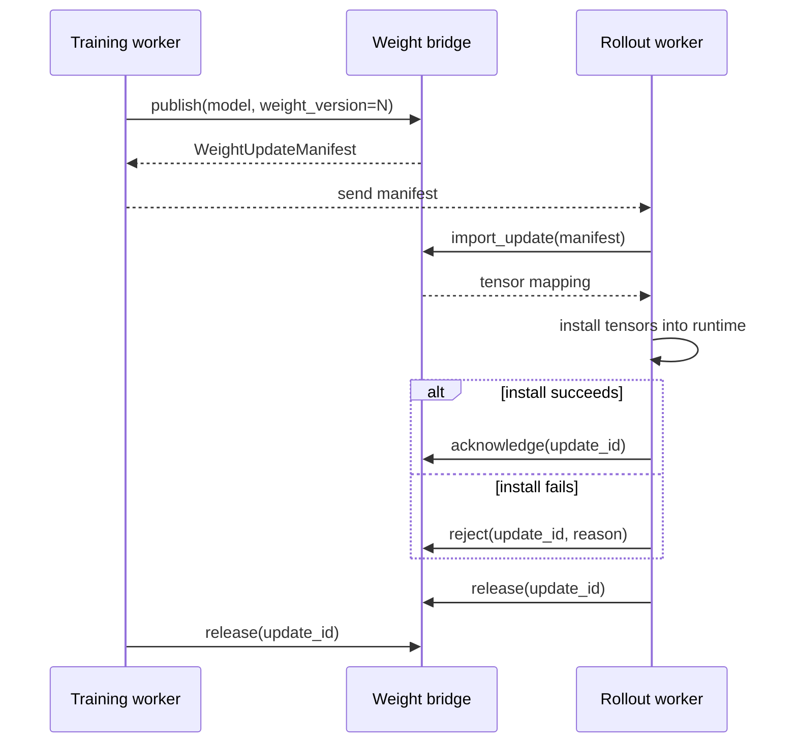

# Weight Sync Bridge

The weight sync bridge moves a complete model-weight update from a training
worker to a rollout worker with an explicit version, tensor metadata, and
lifecycle state.

Think of a published update as a sealed package:

- the tensors are the package contents;
- the `WeightUpdateManifest` is the shipping label;
- `import_update(...)` opens the package on the rollout side;
- `acknowledge(...)` says the rollout worker has safely installed it;
- `reject(...)` records a failed install;
- `release(...)` lets both sides drop buffers, file descriptors, or GPU handles.

This protocol matters because rollout workers must never silently read a
half-updated model. Every update is complete, versioned, validated, and released
when it is no longer active.

## At a Glance

```mermaid
flowchart LR
    subgraph Training["Training side"]
        Model["PyTorch / DeepSpeed model"]
        Publisher["WeightPublisher"]
        Model -->|"state_dict + version"| Publisher
    end

    Publisher -->|"WeightUpdateManifest"| Manifest["Manifest\nversion, tensor metadata,\ntransport handles"]

    subgraph Transport["Bridge transport"]
        Local["local-clone"]
        Shm["shared-memory"]
        VMM["cuda-vmm"]
        IPC["cuda-ipc"]
    end

    Manifest --> Transport

    subgraph Rollout["Rollout / inference side"]
        Consumer["WeightConsumer"]
        Executor["RolloutExecutor.update_weights"]
        Runtime["vLLM / rollout runtime"]
        Consumer -->|"import tensors"| Executor
        Executor -->|"install full update"| Runtime
        Runtime -->|"success"| Ack["acknowledge"]
        Runtime -->|"failure"| Reject["reject"]
    end

    Transport --> Consumer
    Ack --> Release["release update buffers"]
    Reject --> Release
```



In plain words: the training worker does not send "some tensors" and hope the
rollout worker guesses what happened. It publishes a labeled, complete update.
The rollout worker imports that exact update, installs it, and then records
whether the install succeeded.

## When to Use It

Use the bridge when a training process publishes new weights and another runtime,
usually rollout or vLLM inference, must install those weights without restarting.

Common flows:

- local tests use `local-clone`;
- CPU cross-process smoke tests use `shared-memory`;
- same-node CUDA zero-copy uses `cuda-vmm` when supported;
- legacy PyTorch CUDA IPC uses `cuda-ipc` when the current driver/runtime can
  rebuild CUDA IPC handles;
- vLLM integration uses a request builder or install adapter on top of the same
  manifest contract.

## Core Objects

| Object | Role |
| --- | --- |
| `TensorDescriptor` | Shape, dtype, stride, byte count, device, and checksum for one tensor. |
| `WeightUpdateManifest` | Immutable public record for one complete weight update. |
| `WeightPublisher` | Training-side protocol: `publish(...)` and `release(...)`. |
| `WeightConsumer` | Rollout-side protocol: `import_update(...)`, `acknowledge(...)`, `reject(...)`, and `release(...)`. |
| `WeightInstallAdapter` | Optional adapter that installs imported tensors into a runtime such as vLLM. |
| `RolloutExecutor.update_weights(...)` | High-level rollout entry point that imports, installs, acknowledges, and activates a manifest. |

## Lifecycle



Two rules keep the handoff safe:

1. `weight_version` must increase monotonically on the publisher.
2. A consumer should acknowledge only after the runtime has installed the full
   tensor set.

## Choose a Transport

| Transport | Best for | Copy behavior | Notes |
| --- | --- | --- | --- |
| `local-clone` | Unit tests and single-process contract checks | Copies tensors | Safest baseline. It proves version, manifest, ack, reject, and release semantics. |
| `shared-memory` | CPU tensors across local processes | Zero-copy CPU storage import | Uses Python `multiprocessing.shared_memory`. Good for realistic CPU lifecycle tests. |
| `cuda-vmm` | Same-node CUDA handoff | Zero-copy GPU aliasing | Uses CUDA VMM and POSIX file descriptor export. This is the preferred same-node CUDA zero-copy path when available. |
| `cuda-ipc` | Legacy PyTorch CUDA IPC runtimes | Zero-copy GPU aliasing when supported | Uses PyTorch `reduce_tensor` handles. Some WSL2/driver/runtime combinations reject handle rebuild with `CUDA error: invalid resource handle`; in that case use `cuda-vmm`. |

Create bridges through `make_weight_bridge(...)` when possible:

```python
from rl_engine.executors.bridge import make_weight_bridge

training_bridge = make_weight_bridge(
    "shared-memory",
    source_worker="trainer",
    source_rank=0,
)

rollout_bridge = make_weight_bridge(
    "shared-memory",
    source_worker="rollout",
    source_rank=0,
)
```

## Publish and Import Manually

This example uses CPU shared memory so it can run without CUDA:

```python
import torch

from rl_engine.executors.bridge import SharedMemoryTensorBridge

model = torch.nn.Sequential(torch.nn.Linear(4, 4), torch.nn.LayerNorm(4))

publisher = SharedMemoryTensorBridge(source_worker="trainer", source_rank=0)
consumer = SharedMemoryTensorBridge(source_worker="rollout", source_rank=0)

manifest = publisher.publish(
    model,
    weight_version=1,
    metadata={"step": 1, "layout": {"kind": "full-state"}},
)

try:
    tensors = consumer.import_update(manifest)
    # Install tensors into the rollout runtime here.
    consumer.acknowledge(manifest.update_id)
finally:
    consumer.release(manifest.update_id)
    publisher.release(manifest.update_id)
```

The same lifecycle applies to `local-clone`, `cuda-vmm`, and `cuda-ipc`. The
transport changes how tensor storage is shared, not the public protocol.

## Use `RolloutExecutor.update_weights`

Most rollout code should not call `import_update(...)` directly. Use
`RolloutExecutor.update_weights(...)` so import, optional runtime install,
acknowledgement, active-version tracking, and old-update release happen in one
place.

```python
import torch

from rl_engine.executors.bridge import SharedMemoryTensorBridge
from rl_engine.executors.rollout import RolloutExecutor

model = torch.nn.Linear(4, 4)
publisher = SharedMemoryTensorBridge(source_worker="trainer", source_rank=0)
manifest = publisher.publish(model, weight_version=7)

rollout_bridge = SharedMemoryTensorBridge(source_worker="rollout", source_rank=0)
rollout = RolloutExecutor(weight_bridge=rollout_bridge)

try:
    imported = rollout.update_weights(manifest)
    assert rollout.active_weight_version == 7
    assert set(imported) == set(model.state_dict())
finally:
    rollout.release_weights()
    publisher.release(manifest.update_id)
```

If installation fails, `RolloutExecutor` rejects the update and keeps the
previous active version.

## vLLM Hot-Weight Update

vLLM does not accept a raw manifest object. It expects a runtime-specific request
shape. RL-Kernel provides adapters so the bridge lifecycle stays the same while
vLLM receives the format it expects.

For vLLM IPC:

```python
from rl_engine.executors.bridge import VLLMIPCWeightUpdateRequestBuilder

builder = VLLMIPCWeightUpdateRequestBuilder(is_checkpoint_format=False)
request = builder(manifest, imported_cuda_tensors)
llm.init_weight_transfer_engine({"init_info": {}})
llm.update_weights(request)
builder.release(manifest.update_id)
```

For vLLM CUDA VMM external storage, use
`VLLMCUDAVMMExternalStorageAdapter` when the rollout worker can install external
CUDA storage aliases in-process.

The important idea is the same in both paths: keep the publisher-side tensors
alive until vLLM finishes the update, then release the update id.

## CUDA Notes

`cuda-vmm` and `cuda-ipc` are both same-node CUDA transports, but they depend on
different CUDA runtime capabilities.

Use `cuda-vmm` when you need the production-oriented same-node zero-copy path and
the platform supports CUDA VMM export/import.

Use `cuda-ipc` only after validating the runtime. PyTorch CUDA IPC handle rebuild
can fail on some WSL2 or driver combinations with:

```text
CUDA error: invalid resource handle
```

That error means PyTorch could not reopen the CUDA IPC memory handle in the
consumer process. It is a runtime capability blocker, not a manifest validation
failure. The benchmark reports this as `blocked` instead of pretending the
transport succeeded.

## Benchmark and Smoke Tests

Run the local protocol smoke:

```bash
python benchmarks/benchmark_weight_sync_bridge.py --smoke --mode local
python benchmarks/benchmark_weight_sync_bridge.py --smoke --mode shared-memory
```

Run CUDA transport probes when CUDA is available:

```bash
python benchmarks/benchmark_weight_sync_bridge.py --smoke --mode cuda-vmm
python benchmarks/benchmark_weight_sync_bridge.py --smoke --mode cuda-ipc
```

Run rollout and vLLM paths:

```bash
python benchmarks/benchmark_weight_sync_bridge.py --smoke --mode rollout-update
```

Install the vLLM extra before running the vLLM benchmark modes:

```bash
pip install -e ".[vllm]"
python benchmarks/benchmark_weight_sync_bridge.py --mode vllm-cuda-ipc-hot-update --model /path/to/model
python benchmarks/benchmark_weight_sync_bridge.py --mode vllm-cuda-vmm-external-storage --model /path/to/model
```

The benchmark prints one JSON row with:

- transport mode;
- status: `pass` or `blocked`;
- publish/import/ack/release timing;
- tensor count and byte count;
- active weight version;
- environment notes and precise blocker messages.

## Troubleshooting

| Symptom | What it usually means | What to do |
| --- | --- | --- |
| `weight_version must increase monotonically` | The publisher reused an old version. | Increment the version after every completed training step. |
| `cannot acknowledge update before import_update succeeds` | The consumer acknowledged without importing. | Call `import_update(...)`, install tensors, then acknowledge. |
| `tensor checksum mismatch` | The manifest metadata does not match imported tensor contents. | Treat the update as corrupt or stale and reject it. |
| `CUDA IPC handle reconstruction failed` | Legacy CUDA IPC is not working in this runtime. | Use `cuda-vmm` for same-node CUDA zero-copy, or run CUDA IPC on a validated runtime. |
| `multi-node/RDMA weight transport is not implemented` | The bridge only supports same-node layouts today. | Publish a gathered full-state update on one node, or add a dedicated RDMA/NCCL transport. |

## Production Checklist

Before promoting a new weight handoff path:

- run unit tests for manifest validation and lifecycle state transitions;
- run the benchmark mode for the selected transport;
- prove the rollout runtime installs the full tensor set before acknowledgement;
- keep publisher tensors and handles alive until consumers finish;
- record blocked runtime capabilities explicitly instead of falling back silently;
- release both publisher and consumer update ids during shutdown.
